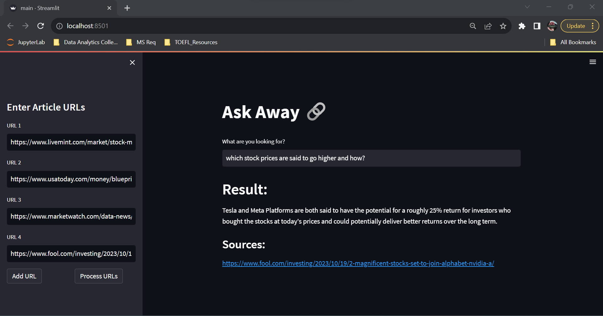

# Ask Away: Article Research Tool

**Ask Away** is an intuitively crafted research tool, seamlessly engineered for the retrieval of information. Empowering users to input article URLs and pose inquiries, it facilitates the extraction of relevant insights from the articles with utmost ease and efficiency."





## Features:

  - Enter the URLs to fetch article content.
  - Load files from remote URLs using UnstructuredURLLoader.
  - Construct an embedding vector using OpenAI's embeddings and leverage FAISS, a powerful similarity search library, to enable swift and effective retrieval of relevant information
  - Interact with OpenAI's Language Model (ChatGPT) by submitting queries, and in return, obtain comprehensive answers accompanied by source URLs.


## Installation

  1. Clone this repository to your local machine using:

  ```bash
    git clone https://github.com/Magical-Mist/Article_Analyzer.git
  ```
  2. Navigate to the project directory:

  ```bash
    cd article_analyzer
  ```
  3. Install the required dependencies using pip:

  ```bash
    pip install -r requirements.txt
  ```
  4. Set up your OpenAI API key by creating a .env file in the project root and adding your API

  ```bash
    OPENAI_API_KEY=your_api_key_here
  ```
  5. Enter your user-agent in UnstructuredURLLoader's header or remove the header parameter in _main.py_ file.

## How to Run?

  1. Run the Streamlit app by executing:

  ```bash
    streamlit run main.py
  ```
  2. The web application will open in your browser.
    - On the sidebar, you can enter the URLs directly.
    - Initiate data loading and processing by clicking "Process URLs".
    - The application informs each stage of processing it is undergoing, such as: text splitting, generating embedding vectors.
    - The embeddings will be stored and indexed using FAISS, enhancing retrieval speed.
    - The FAISS index will be saved in a local file path in pickle format for future use (faiss_index_store.pkl).
    - Pose a question and receive an answer derived from pertinent articles.
    - Articles used in image:
      - https://www.livemint.com/market/stock-market-news/nifty-50-sensex-today-what-to-expect-from-stock-market-indices-in-trade-on-october-19-11697679420921.html
      - https://www.usatoday.com/money/blueprint/investing/stock-forecast-apple/#:~:text=Is%20Apple%20a%20long%2Dterm,12%25%20upside%20from%20current%20levels.
      - https://www.marketwatch.com/data-news/alphabet-inc-cl-a-stock-outperforms-market-despite-losses-on-the-day-36ec519a-22fefa983c23?mod=mw_quote_news
      - https://www.fool.com/investing/2023/10/19/2-magnificent-stocks-set-to-join-alphabet-nvidia-a/

## Project Structure

  - main.py: The main Streamlit application script.
  - requirements.txt: mentions the required Python packages for the project.
  - faiss_index_store.pkl: Pickle file that stores the FAISS index.
  - .env: Configuration file to store your OpenAI API key.